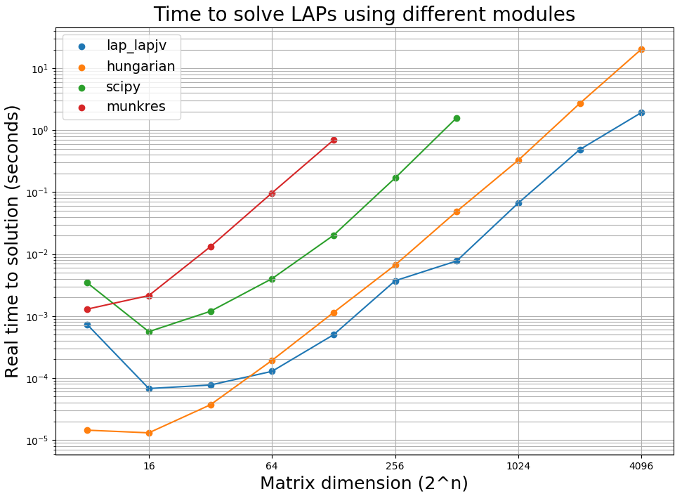
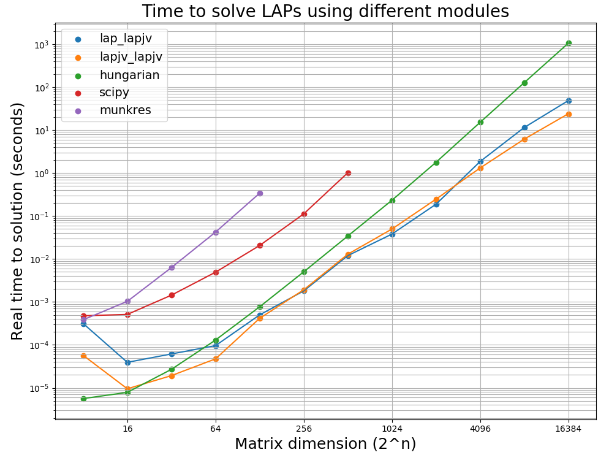

# Purpose

The scripts benchmark the performance of Python2/3 linear assignment problem solvers for random cost matrices of different sizes.  These solvers are:

* **linear_sum_assignment** - a Python implementation of the Hungarian algorithm provided in SciPy
  * https://docs.scipy.org/doc/scipy-0.18.1/reference/generated/scipy.optimize.linear_sum_assignment.html
* **munkres** - a Python implementation of the Hungarian algorithm provided by Brian Clapper
  * https://github.com/bmc/munkres
* **hungarian** - a wrapper to a C++ implementation Knuth's Hungarian algorithm provided by Harold Cooper
  * https://github.com/Hrldcpr/Hungarian
* **lap.lapjv** - a wrapper to a C++ implementation of Jonker-Volgenant algorithm provided by Tomas Kazmar
  * https://github.com/gatagat/lap

  In addition, these two solvers are added for Python3
* **lapjv.lapjv** - a wrapper to a C++ implementation of Jonker-Volgenant algorithm re-written for Python 3 and optimized to take advantage of AVX2 instruction sets by Vadim Markovtsev at src{d}.
  * Please see the [blog post here](https://blog.sourced.tech/post/lapjv/)
  * https://github.com/src-d/lapjv  
* **lapsolver** - implementation for dense matrices based on shortest path augmentation by Christoph Heindl.
  * Please note that Christioph has also done a [benchmark of LAP solvers](https://github.com/cheind/py-lapsolver/tree/master/lapsolver/benchmarks)
  * https://github.com/src-d/lapjv      

They all formally have O(n<sup>3</sup>) complexity, but their performance differs substantially based on their implementation and the size of the matrix they are trying to solve. The purpose of this benchmarking exercise is to see which implementation performs best for a given matrix size. My interest is to use this information to improve the performance of [Arbalign](https://github.com/berhane/arbalign) and expand its use.

# Contents
The repo contains the following:
* `benchmark-lap-solvers-py2.py` - a Python2 script comparing the first four implementations
* `benchmark-lap-solvers-py3.py` - a Python3 script comparing all five four implementations

# Usage
It's simple once you have installed the necessary packages.

```
Usage: benchmark-lap-solvers-py2.py [-h] [-c] [-v] [-np] [--min [min]]
                                    [--max [max]] [--ncyc [ncyc]]

    Benchmarks the performance of linear assignment problem solvers for random cost matrices
    of different dimensions.


optional arguments:
  -h, --help       show this help message and exit
  -c, --printcost  Print the minimum cost. The default is false, i.e. will not
                   print the minmum cost
  -v, --verbose    Determines verbosity. The default is minimal printing, i.e.
                   not verbose
  -np, --noplot    Plot data using matplotlib. The default is true, i.e.
                   generate plot
  --min [min]      minimum dimension of cost matrix to solve. The default is 8
                   (2^3 x 2^3)
  --max [max]      maximum dimension of cost matrix to solve. The default is
                   4096 (2^12 x 2^12)
  --ncyc [ncyc]    number of times to solve cost matrices and average their
                   timing. The default is 3 cycles

    The script  will produce the following:
    1) data of timing for LAP solving random cost matrices of dimensions 2^{min} - 2^{max}
    2) plot of timing for LAP solving random cost matrices of dimensions 2^{min} - 2^{max}
```
<!--
## Examples
| command   |      execution    |  note     |
|----------|:-------------:|:-------|
| `./benchmark-lap-solvers-py3.py` | `./benchmark-lap-solvers-py3.py --ncyc 3 --min 8 --max 4096` | default |
| `./benchmark-lap-solvers-py3.py --min 2 --max 512` | `./benchmark-lap-solvers-py3.py --ncyc 3 --min 2 --max 512` | default, except it looks at small matrices only |
| `./benchmark-lap-solvers-py3.py -np` | `./benchmark-lap-solvers-py3.py --ncyc 3 --min 8 --max 4096 -np` | default, except plotting is suppressed |
| `./benchmark-lap-solvers-py3.py --printcost` | `./benchmark-lap-solvers-py3.py --ncyc 3 --min 8 --max 4096 --printcost` | default, except it prints lowest cost for each method |
-->

If you want to add other solvers to the list, it should be easy to figure out what parts to update in the scripts.

# Requirements
* `numpy` module. If you don't have it already, you can install it using `pip[2/3]`
  * `pip[2/3] install numpy`
* `matplotlib` module.
  * `pip[2/3] install   matplotlib`
* scipy module.
  * `pip[2/3] install  scipy`
* `munkres` module by Brian Clapper.
   * `pip[2/3] install munkres`
* `hungarian` module by Harold Cooper.
  * `pip[2/3] install   hungarian`
* `lap` module by Tomas Kozmar.
  * `pip[2/3] install lap`
* `lapjv` module by src{d} for Python3
  * `pip3 install lapjv`
* `lapsolver` module by Christoph Heindl
    * `pip3 install lapsolver`
# Output
The script  will produce output similar to this. **The output here corresponds to an average of three Python 2.7.15/3.7.1 runs on a 2013 MacPro with a 3.5 GHz Intel Xeon E5-1650v2 processor and 32GB of RAM**

## Python2
* data of timing for LAP solving random cost matrices of sizes 2<sup>min</sup> - 2<sup>max</sup>

<pre>
Solving matrices of sizes up to limit 2^{n} where n is {'munkres': 7, 'scipy': 9, 'hungarian': 13, 'lap.lapjv': 13}

8 x 8
16 x 16
32 x 32
64 x 64
128 x 128
256 x 256
512 x 512
1024 x 1024
2048 x 2048
4096 x 4096

Matrix size  [   8      16       32      64     128     256     512     1024    2048   4096]
     lapjv  [0.00007 0.00003 0.00004 0.00008 0.00022 0.00149 0.00574 0.03733 0.22209  1.14318]
 hungarian  [0.00001 0.00001 0.00002 0.00011 0.00066 0.00472 0.03157 0.21561 1.71368 14.11281]
     scipy  [0.0004  0.00044 0.00086 0.00353 0.01809 0.10358 1.01071]
   munkres  [0.00033 0.00091 0.00445 0.03216 0.25957]
</pre>

* plot of timing for LAP solving random cost matrices of sizes 2<sup>min</sup> - 2<sup>max</sup>



If requested via the `--printcost` flag, it will also print the minimum cost for each random cost matrix by each implementation. This test ensures that the methods are making consistent/correct assignments.
<pre>
8 x 8 ... cycle
('Cycle ', '0 ')
    lap_lapjv_cost    10.649
    Hungarian_cost    10.649
        Scipy_cost    10.649
      Munkres_cost    10.649
('Cycle ', '1 ')
    lap_lapjv_cost    10.399
    Hungarian_cost    10.399
        Scipy_cost    10.399
      Munkres_cost    10.399
('Cycle ', '2 ')
    lap_lapjv_cost    7.654
    Hungarian_cost    7.654
        Scipy_cost    7.654
      Munkres_cost    7.654
.
.
.
2048 x 2048 ... cycle
('Cycle ', '0 ')
    lap_lapjv_cost    3388.642
    Hungarian_cost    3388.642
('Cycle ', '1 ')
    lap_lapjv_cost    3269.750
    Hungarian_cost    3269.750
('Cycle ', '2 ')
    lap_lapjv_cost    3424.101
    Hungarian_cost    3424.101      
</pre>


## Python3
<pre>
Solving matrices of sizes up to limit 2^{n} where n is {'munkres': 7, 'scipy': 9, 'hungarian': 14, 'lap_lapjv': 14, 'lapjv_lapjv': 14, 'lapsolver': 14}

8 x 8 ... cycle  0  1  2
16 x 16 ... cycle  0  1  2
32 x 32 ... cycle  0  1  2
64 x 64 ... cycle  0  1  2
128 x 128 ... cycle  0  1  2
256 x 256 ... cycle  0  1  2
512 x 512 ... cycle  0  1  2
1024 x 1024 ... cycle  0  1  2
2048 x 2048 ... cycle  0  1  2
4096 x 4096 ... cycle  0  1  2
8192 x 8192 ... cycle  0  1  2

Matrix_size       8      16      32      64     128     256     512    1024    2048    4096     8192
  lap_lapjv  [0.00007 0.00006 0.00008 0.00015 0.00031 0.00208 0.00788 0.0609  0.24545  1.2339    9.28052]
lapjv_lapjv  [0.00001 0.00001 0.00002 0.00016 0.00027 0.00201 0.00856 0.06035 0.33224  1.196     5.7255 ]
  lapsolver  [0.00002 0.00003 0.00005 0.00016 0.00057 0.00284 0.01274 0.07896 0.43998  2.32273  12.94027]
  hungarian  [0.00001 0.00002 0.00004 0.00015 0.00078 0.00475 0.03255 0.23945 1.79907 14.8607  128.75066]
      scipy  [0.00110 0.00262 0.00727 0.02644 0.11247 0.59904 4.39246]
    munkres  [0.00096 0.00799 0.07254 0.77326 7.24882]
</pre>



# Takeaways

1. `scipy` and `munkres` are much slower than `hungarian`, `lapsolver`, `lap.lapjv`, and `lapjv.lapjv` for all matrix sizes
2. `hungarian` performs well for smaller matrices. For anything larger than 256x256, `lapsolver`, `lap.lapjv` and `lapjv.lapjv` are about an order of magnitude faster than `hungarian`
3. `lap.lapjv` is am implementation intended to solve dense matrices. Its sparse matrix solver analog named `lap.lapmod` is more efficient for larger sparse matrices. Both are implemented in the `lap` module.
4. `lapjv.lapjv` has the best performance virtually for all matrix sizes.
5. For the purposes of improving [Arbalign](https://github.com/berhane/arbalign), `hungarian` remains a good choice for most molecular systems I'm interested in which don't have more than 100x100 distance matrices the same type to solve. However, if the tool is to be applied to larger molecules such as proteins and DNA, it would be worthwhile to use `lapjv.lapjv`, `lapsolver`, `lap.lapjv` or `lap.lapmod`
