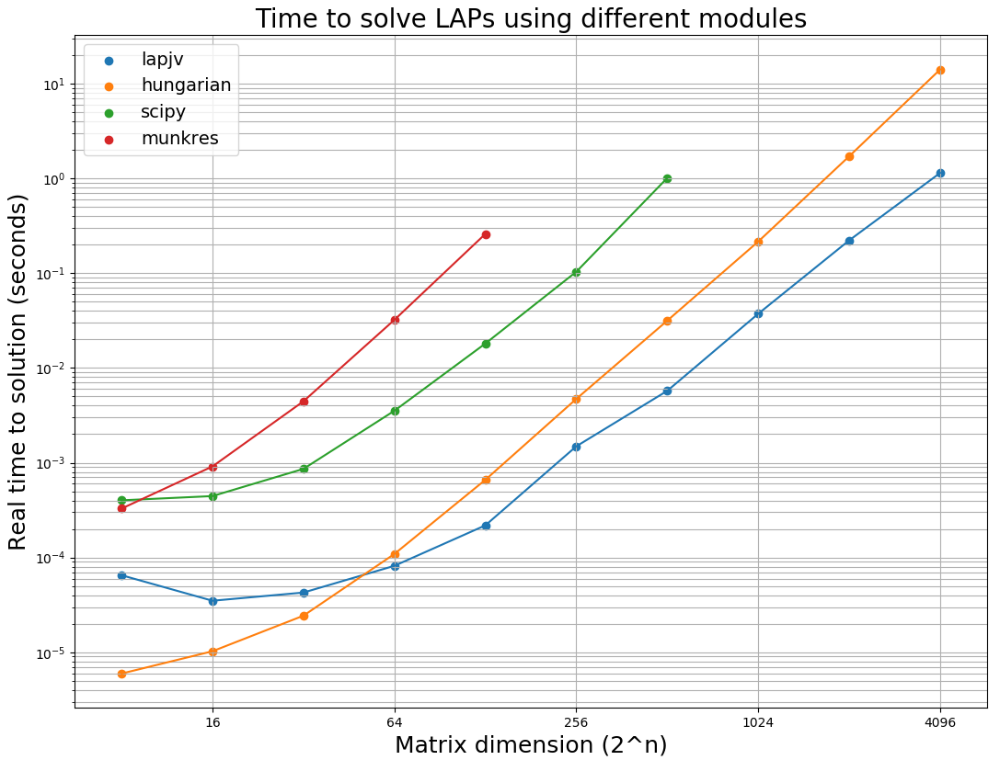

# Purpose

The script benchmarks the performance of four linear assignment problem solvers
for cost matrices of different sizes.  These solvers are:

* **linear_sum_assignment** - version provided in scipy
  * https://docs.scipy.org/doc/scipy-0.18.1/reference/generated/scipy.optimize.linear_sum_assignment.html
* **munkres** - a Python implementation provided by Brian Clapper
    * https://github.com/bmc/munkres
* **hungarian** - a wrapper to a C++ implementation Knuth's Hungarian algorithm provided by Harold Cooper
  * https://github.com/Hrldcpr/Hungarian
* **lapjv** - a wrapper to a C++ implementation of Jonker-Volgenant algorithm provided by Tomas Kazmar
  * https://github.com/gatagat/lap

They all formally have O(n<sup>3</sup>) complexity, but their performance differs substantially based on their implementation and the size of the matrix they are trying to solve. The purpose of this benchmarking exercise is to see which implementation performs best for a given matrix size. My interest is to use this information to improve the performance of [Arbalign](https://github.com/berhane/arbalign) and expand its use.

# Contents
The repo contains the following items:
* benchmark-lap-solvers.py - a Python script

# Usage
It's simple once you have installed the necessary packages.

```
Usage: benchmark-lap-solvers.py [-h] [--min [min]] [--max [max]]
                                [--ncyc [n_cycles]]

    Benchmarks the performance of linear assignment problem solvers for random cost matrices
    of different sizes.


optional arguments:
  -h, --help         show this help message and exit
  --min [min]        minimum size of cost matrix to solve. The default is 8x8
                     (2^3 x 2^3)
  --max [max]        maximum size of cost matrix to solve. The default is
                     4096x4096 (2^12 x 2^12)
  --ncyc [n_cycles]  number of times to solve cost matrices and average their
                     timing. The default is 3 cycles

    The script  will produce the following:
    1) data of timing for LAP solving random cost matrices of sizes 2^{min} - 2^{max}
    2) plot of timing for LAP solving random cost matrices of sizes 2^{min} - 2^{max}
```

# Requirements
* Python numpy module. If you don't have it already, you can install it using `pip`
  * `pip install numpy`
* Python scipy module.
  * `pip install  scipy`
* Python matplotlib module.
  * `pip install   matplotlib`
* Python `hungarian` module by Harold Cooper.
  * `pip install   hungarian`
* Python `lap` module by Tomas Kozmar.
  * `pip install lap`
* Python `munkres` module by Brian Clapper.
    * `pip install munkres`

# Output
The script  will produce the following:
* data of timing for LAP solving random cost matrices of sizes 2^{min} - 2^{max}

<pre>
Solving matrices of sizes up to limit 2^{n} where n is
{'munkres': 7, 'scipy': 9, 'hungarian': 12, 'lapjv': 12}
8 x 8
16 x 16
32 x 32
64 x 64
128 x 128
256 x 256
512 x 512
1024 x 1024
2048 x 2048

Matrix size  [   8      16       32      64     128     256     512     1024    2048]
     lapjv  [0.00007 0.00004 0.00005 0.00009 0.00035 0.00136 0.01013 0.06211 0.19604]
 hungarian  [0.00001 0.00001 0.00003 0.00013 0.00083 0.00472 0.03273 0.22168 1.69292]
     scipy  [0.00031 0.00052 0.00135 0.00386 0.02158 0.09982 1.11753]
   munkres  [0.00029 0.00118 0.00517 0.03652 0.28729]
</pre>

* plot of timing for LAP solving random cost matrices of sizes 2<sup>min</sup> - 2<sup>max</sup>



# Takeaways

1. `scipy` and `munkres` are much less efficient than `hungarian` and `lapjv` for all matrix sizes
2. `hungarian` performs better than `lapjv` for matrices of size less than 64x64. For Anything larger than 256x256, `lapjv` is about an order of magnitude faster than `hungarian`
3. `lapjv` is am implementation intended to solve dense metrices. Its sparse matrix solver analog named `lapmod` is more efficient for larger sparse matrices. Both are implemented in the `lap` module.
4. For the purposes of improving [Arbalign](https://github.com/berhane/arbalign), `hungarian` remains the best choice for most molecular systems I'm interested in which don't have more than 100 atoms of the same type. However, if the tool is to be applied to larger molecules such as proteins and DNA, it would be worthwhile to use `lapjv` or even `lapmod`
