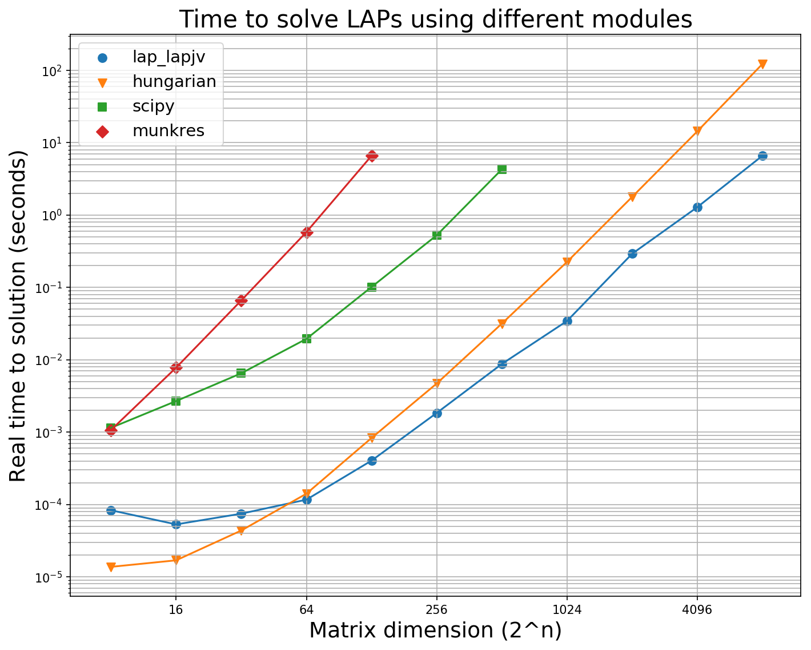
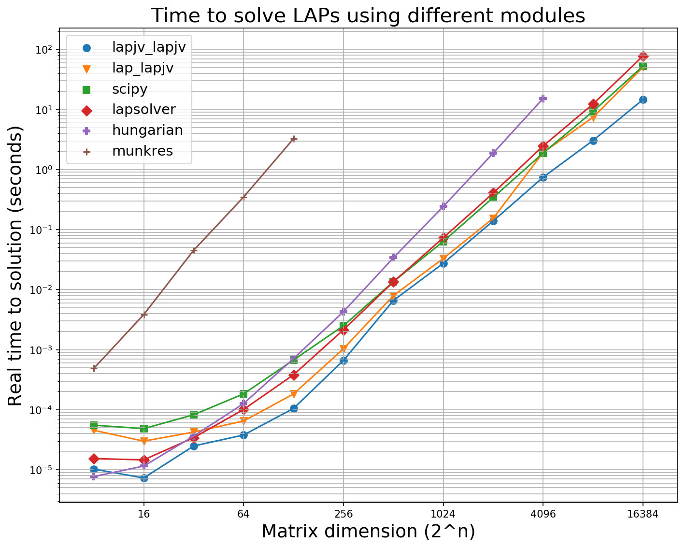

# Purpose

The scripts benchmark the performance of four/five Python2/3 linear assignment problem solvers for cost matrices of different sizes.  These solvers are:

* **linear_sum_assignment** - version provided in scipy
  * https://docs.scipy.org/doc/scipy-0.18.1/reference/generated/scipy.optimize.linear_sum_assignment.html
* **munkres** - a Python implementation provided by Brian Clapper
    * https://github.com/bmc/munkres
* **hungarian** - a wrapper to a C++ implementation Knuth's Hungarian algorithm provided by Harold Cooper
  * https://github.com/Hrldcpr/Hungarian
* **lap.lapjv** - a wrapper to a C++ implementation of Jonker-Volgenant algorithm provided by Tomas Kazmar
  * https://github.com/gatagat/lap
* **lapjv.lapjv** - a wrapper to a C++ implementation of Jonker-Volgenant algorithm re-written for Python 3 by source{d}
    * https://github.com/src-d/lapjv  

They all formally have O(n<sup>3</sup>) complexity, but their performance differs substantially based on their implementation and the size of the matrix they are trying to solve. The purpose of this benchmarking exercise is to see which implementation performs best for a given matrix size. My interest is to use this information to improve the performance of [Arbalign](https://github.com/berhane/arbalign) and expand its use.

# Contents
The repo contains the following:
* `benchmark-lap-solvers-py2.py` - a Python2 script comparing the first four implementations
* `benchmark-lap-solvers-py3.py` - a Python3 script comparing all five four implementations

# Usage
It's simple once you have installed the necessary packages.

```
Usage: benchmark-lap-solvers-py2.py [-h] [-c] [-v] [-np] [--min [min]]
                                    [--max [max]] [--ncyc [ncyc]]

    Benchmarks the performance of linear assignment problem solvers for random cost matrices
    of different dimensions.


optional arguments:
  -h, --help       show this help message and exit
  -c, --printcost  Print the minimum cost. The default is false, i.e. will not
                   print the minmum cost
  -v, --verbose    Determines verbosity. The default is minimal printing, i.e.
                   not verbose
  -np, --noplot    Plot data using matplotlib. The default is true, i.e.
                   generate plot
  --min [min]      minimum dimension of cost matrix to solve. The default is 8
                   (2^3 x 2^3)
  --max [max]      maximum dimension of cost matrix to solve. The default is
                   4096 (2^12 x 2^12)
  --ncyc [ncyc]    number of times to solve cost matrices and average their
                   timing. The default is 3 cycles

    The script  will produce the following:
    1) data of timing for LAP solving random cost matrices of dimensions 2^{min} - 2^{max}
    2) plot of timing for LAP solving random cost matrices of dimensions 2^{min} - 2^{max}
```

Eg: `./benchmark-lap-solvers.py` which is equivalent to
    `./benchmark-lap-solvers.py --ncyc 3 --min 8 --max 4096`

If you want to add other solvers to the list, it should be easy to figure out what parts to update in the scripts.

# Requirements
* `numpy` module. If you don't have it already, you can install it using `pip[2/3]`
  * `pip[2/3] install numpy`
* `matplotlib` module.
  * `pip[2/3] install   matplotlib`
* scipy module.
  * `pip[2/3] install  scipy`
* `munkres` module by Brian Clapper.
   * `pip[2/3] install munkres`
* `hungarian` module by Harold Cooper.
  * `pip[2/3] install   hungarian`
* `lap` module by Tomas Kozmar.
  * `pip[2/3] install lap`
* `lapjv` module by source{d} for Python3
  * `pip3 install lapjv`

# Output
The script  will produce output similar to this. **The output here corresponds to an average of three Python2/3 runs on a 2015 MacBook Air with Intel® Core™ i5-5250U Processor and 8GB RAM**

## Python2
* data of timing for LAP solving random cost matrices of sizes 2^{min} - 2^{max}

<pre>
Solving matrices of sizes up to limit 2^{n} where n is {'munkres': 7, 'scipy': 9, 'hungarian': 13, 'lap.lapjv': 13}

8 x 8
16 x 16
32 x 32
64 x 64
128 x 128
256 x 256
512 x 512
1024 x 1024
2048 x 2048
4096 x 4096

Matrix size  [   8      16       32      64     128     256     512     1024    2048   4096]
     lapjv  [0.00007 0.00003 0.00004 0.00008 0.00022 0.00149 0.00574 0.03733 0.22209  1.14318]
 hungarian  [0.00001 0.00001 0.00002 0.00011 0.00066 0.00472 0.03157 0.21561 1.71368 14.11281]
     scipy  [0.0004  0.00044 0.00086 0.00353 0.01809 0.10358 1.01071]
   munkres  [0.00033 0.00091 0.00445 0.03216 0.25957]
</pre>

* plot of timing for LAP solving random cost matrices of sizes 2<sup>min</sup> - 2<sup>max</sup>



If requested via the `--printcost` flag, it will also print the lowest cost predicted by implementation. This test ensures that the methods are making accurate assignments.
<pre>
8 x 8 ... cycle
('Cycle ', '0 ')
    lap_lapjv_cost    10.649
    Hungarian_cost    10.649
        Scipy_cost    10.649
      Munkres_cost    10.649
('Cycle ', '1 ')
    lap_lapjv_cost    10.399
    Hungarian_cost    10.399
        Scipy_cost    10.399
      Munkres_cost    10.399
('Cycle ', '2 ')
    lap_lapjv_cost    7.654
    Hungarian_cost    7.654
        Scipy_cost    7.654
      Munkres_cost    7.654
.
,
,
2048 x 2048 ... cycle
('Cycle ', '0 ')
    lap_lapjv_cost    3388.642
    Hungarian_cost    3388.642
('Cycle ', '1 ')
    lap_lapjv_cost    3269.750
    Hungarian_cost    3269.750
('Cycle ', '2 ')
    lap_lapjv_cost    3424.101
    Hungarian_cost    3424.101      
</pre>


## Python3
<pre>
Solving matrices of sizes up to limit 2^{n} where n is {'munkres': 7, 'scipy': 9, 'hungarian': 15, 'lap_lapjv': 15, 'lapjv_lapjv': 15}

8 x 8 ... cycle  0  1  2
16 x 16 ... cycle  0  1  2
32 x 32 ... cycle  0  1  2
64 x 64 ... cycle  0  1  2
128 x 128 ... cycle  0  1  2
256 x 256 ... cycle  0  1  2
512 x 512 ... cycle  0  1  2
1024 x 1024 ... cycle  0  1  2
2048 x 2048 ... cycle  0  1  2
4096 x 4096 ... cycle  0  1  2
8192 x 8192 ... cycle  0  1  2
16384 x 16384 ... cycle  0  1  2

Matrix_size       8      16      32       64      128       256       512     1024     2048     4096      8192     16384
 lap_lapjv   [0.00031  0.00004  0.00006  0.0001   0.0005   0.00181  0.01198  0.03803  0.18864  1.85925  11.50524   48.73192]
lapjv_lapjv  [0.00006  0.00001  0.00002  0.00005  0.00042  0.00192  0.01294  0.04984  0.24718  1.31449   6.16797   24.03292]
 hungarian   [0.00001  0.00001  0.00003  0.00013  0.00077  0.00503  0.03432  0.23316  1.78575 15.18274 127.31623 1055.05817]
     scipy   [0.00048  0.00051  0.00144  0.00493  0.02063  0.11216  1.01937]
   munkres   [0.00039  0.00103  0.00633  0.04225  0.34005]
</pre>



# Takeaways

1. `scipy` and `munkres` are much slower than `hungarian`, `lap.lapjv`, and `lapjv.lapjv` for all matrix sizes
2. `hungarian` performs better than `lap.lapjv` and `lapjv.lapjv` for matrices of size less than 16x16. For Anything larger than 256x256, `lap.lapjv` and `lapjv.lapjv` are about an order of magnitude faster than `hungarian`
3. `lap.lapjv` is am implementation intended to solve dense matrices. Its sparse matrix solver analog named `lap.lapmod` is more efficient for larger sparse matrices. Both are implemented in the `lap` module.
4. `lapjv.lapjv` has the best performance virtually for all matrix sizes.
5. There is definitely a need to check that all these methods reach the same solutions/assigments.
5. For the purposes of improving [Arbalign](https://github.com/berhane/arbalign), `hungarian` remains a good choice for most molecular systems I'm interested in which don't have more than 100x100 distance matrices the same type to solve. However, if the tool is to be applied to larger molecules such as proteins and DNA, it would be worthwhile to use `lapjv.lapjv`, `lap.lapjv` or `lap.lapmod`
